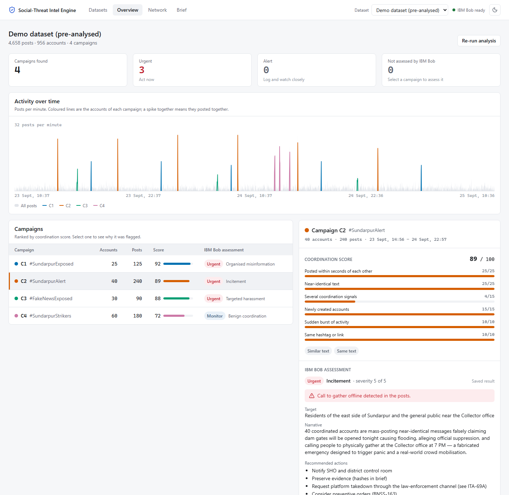
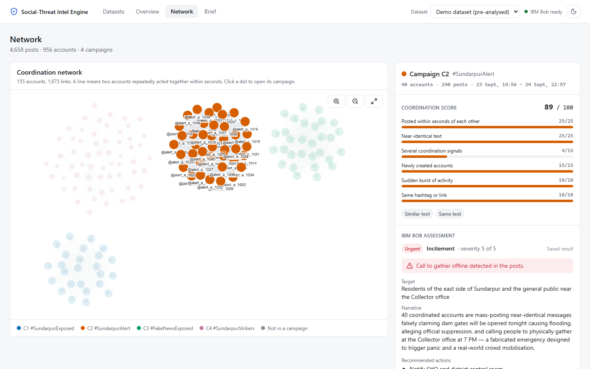
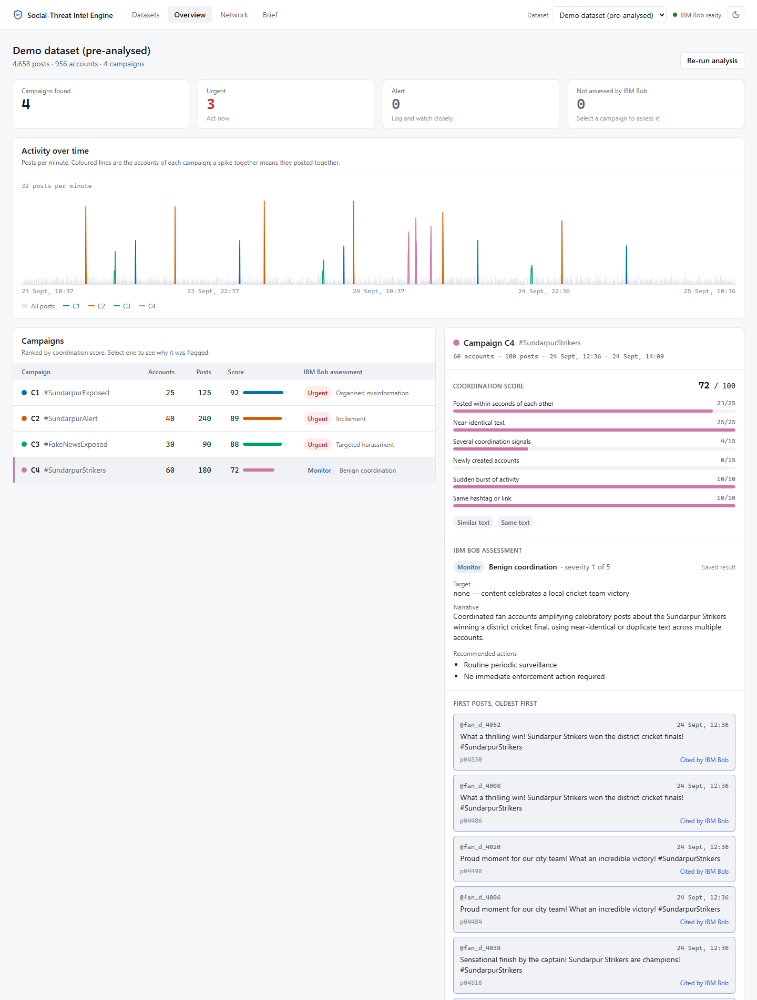
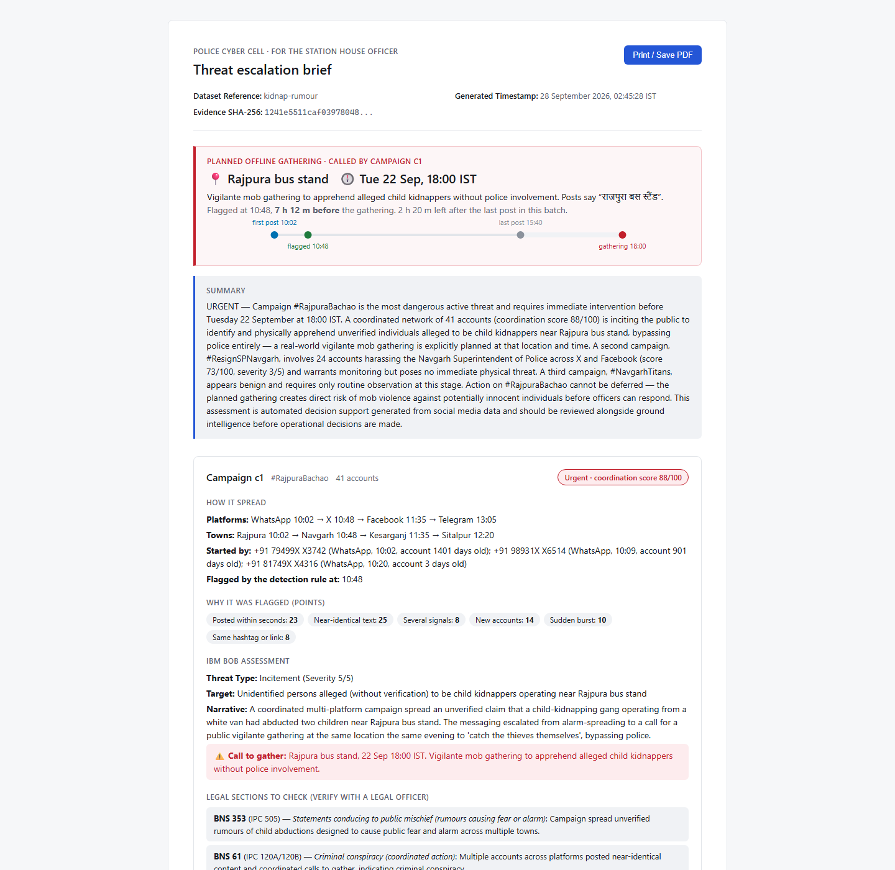

# 🛡️ Social Media Threat Intelligence Engine

> An AI-powered Open Source Intelligence (OSINT) and Coordinated Inauthentic Behavior (CIB) detection engine for Law Enforcement Cyber Cells, powered by **IBM Bob**.

---

## 👥 Team Shin-chan

| Role | Name | Email | Focus Area |
|---|---|---|---|
| **Lead / Forensics** | Tirth Chokshi | chokshitirth4@gmail.com | System Architecture, Coordination Engine & Pipeline |
| **Frontend Engineering** | Milind Pawar | milindpawar1639@gmail.com | React 19 UI, Cytoscape Graph & Interactive Timeline |
| **Bob Layer & MCP** | Jainik Devada | — | IBM Bob Integration, MCP Server, Legal Mapping |
| **Data & Benchmarking** | Jigar Jariwala | — | Scenario Synthesis, Real Data Adapters, Evaluation |

---

## 🎯 Problem Statement

**Problem #06 — Track 2: Cyber Forensics (IBM Bob AI Innovation Hackathon / INNOVAI)**

During sensitive incidents (such as communal tensions or civil protests), coordinated social media botnets and sock-puppet networks rapidly amplify rumours, incite physical violence, and coordinate harassment pile-ons. Current cyber cell workflows rely on manual post-by-post scanning, which fails because **individual posts often appear harmless in isolation** while working in concert to create dangerous offline mobilization.

Officers lack an automated system that detects synchronized coordination topologies, rates campaign risk, maps applicable legal sections under Indian law (**Bharatiya Nyaya Sanhita 2023** and the **Information Technology Act**), and generates tamper-evident briefs compliant with **Section 63 of the Bharatiya Sakshya Adhiniyam (BSA) 2023**.

---

## 💡 What an officer sees

Bring in posts as **X API v2 JSON**, exactly as the API returns them (search, timeline or filtered-stream output, uploaded or fetched from the app), and one screen answers:

- **Where and when is a crowd being called?** IBM Bob reads the posts in Hindi, Hinglish or English and extracts the planned gathering. The place must be quoted from a post and the time must be plausible, or it is dropped.
- **How early did we catch it?** Each campaign records the earliest time the detection rule was met, shown against any planned gathering as the lead time.
- **How did it spread?** Place by place (from each post's place or the author's profile location), with times; who reposted, replied to and quoted what.
- **Who started it, and who amplified it?** First posters, most connected accounts, and how many accounts are days old.
- **What does the data actually say?** A Posts view searches and filters every post; any account, hashtag, town or campaign is one click away. Languages are detected in any script, and times are shown in the dataset's own clock (IST or UTC).
- **What law applies and what to do now?** Sections from a fixed BNS 2023 / IT Act table (marked for legal verification), place- and time-specific escalation steps, and a time-stamped, print-ready brief with SHA-256 evidence hashes.

**Behaviour first, content second.** Individual posts often look harmless; the tell is many accounts acting together within seconds.

1. **Coordination detection** (deterministic): the QUT coordination-network-toolkit builds five networks (same text, similar text, same link or video, replies to the same post, same retweet) within 60-second windows; NetworkX Louvain finds the campaigns; an explainable 0–100 score shows *why* each was flagged.
2. **Spread profile** (deterministic): seeds, amplifiers, platform and town paths, speed, and the earliest time the detection rule was met.
3. **IBM Bob** (`bob run`, headless): threat type, target, severity, planned gathering, legal-table IDs and the posts it relied on. Every field is checked in code.
4. **Escalation rules and brief**: URGENT / ALERT / MONITOR from fixed rules, never from the AI alone.

---

## 📸 Interface & Workflow Screenshots

| Overview: threat, timeline, spread | Network: who coordinated with whom |
|---|---|
|  |  |

| IBM Bob assessment and spread detail | Threat brief |
|---|---|
|  |  |

*(Full gallery in [`demo/screenshots/README.md`](demo/screenshots/README.md). These were taken on the earlier generated demo incidents, which have since been removed; retake them on your own data.)*

---

## 📊 Evaluation

`python src/eval/measure.py` analyses every X API v2 JSON file in `data/raw` and writes [`src/eval/results.md`](src/eval/results.md).
Results will be added once the incident dataset has been collected as X API v2 JSON.

The score weights were set by hand and are not calibrated on labelled data.

**IBM Bob cost:** about 0.03–0.04 Bobcoins and 15–25 s per classification (measured). Saved verdicts cost nothing.

---

## 🏛️ Indian Legal Framework (BNS 2023 & IT Act)

All statutory suggestions are filtered against our legal reference table (`.bob/rules-osint-analyst/01-legal-table.md`) and clearly marked for legal officer verification:

| Section Code | Law (2024) | Corresponding IPC | Forensic Scope |
|---|---|---|---|
| `BNS-353` | BNS Section 353 | IPC 505 | Statements conducing to public mischief (rumours causing fear or alarm) |
| `BNS-61` | BNS Section 61 | IPC 120A/120B | Criminal conspiracy (coordinated multi-account rings) |
| `BNS-196` | BNS Section 196 | IPC 153A | Promoting enmity between religious or regional groups |
| `BNS-351` | BNS Section 351 | IPC 506 | Criminal intimidation |
| `BNS-356` | BNS Section 356 | IPC 499/500 | Defamation and reputational attacks |
| `BNS-79` | BNS Section 79 | IPC 509 | Word, gesture or act insulting the modesty of a woman |
| `ITA-66D` | IT Act Section 66D | — | Cheating by personation using computer resources (sock puppets) |
| `ITA-69A` | IT Act Section 69A | — | Platform takedown requests through proper government channels |
| `BNSS-163` | BNSS Section 163 | CrPC 144 | Preventive public order directives |
| `BSA-63` | BSA Section 63 | Evidence Act 65B | Electronic record hash certificate (SHA-256 integrity chain) |

*Note: Banned/struck-down sections (e.g. IT Act Section 66A) are strictly blocked.*

---

## 🛠️ Tech Stack & Implementation Details

- **Coordination Detection:** `coordination_network_toolkit` (QUT Digital Observatory, MIT license)
- **Graph Clustering:** `NetworkX` (Louvain community modularity algorithm)
- **Backend Service:** `FastAPI`, `Uvicorn`, `Pydantic v2`, `python-dotenv`
- **Frontend Architecture:** `React 19`, `Vite`, `Tailwind CSS v4`, `Cytoscape.js`, `Lucide Icons`; design language in [`docs/design-system.md`](docs/design-system.md)
- **AI & Reasoning:** `IBM Bob Shell 2.0` (Headless CLI `bob run`, custom mode `osint-analyst`, FastMCP integration server)
- **Storage:** Local SQLite for multi-signal joins, JSON disk runs with SHA-256 tamper-evident logs

---

## ⚡ Quickstart & How to Run

### 1. Prerequisites
- Python 3.10+ and Node.js 24+
- IBM Bob Shell ([bob.ibm.com/download](https://bob.ibm.com/download)); see [`docs/setup-guide.md`](docs/setup-guide.md) for details

### 2. Setup
```bash
git clone https://github.com/Tirth-chokshi/bob-ai-hackathon-shin-chan.git
cd bob-ai-hackathon-shin-chan

# Install Python backend dependencies
python -m pip install -r src/requirements.txt

# Build the React frontend (src/web/dist is not committed)
cd src/web && npm ci && npm run build && cd ../..

# (Optional) Add your IBM Bob API key to src/.env for live classifications
cp src/.env.example src/.env
```

### 3. Launch Application
```bash
python src/main.py
```
Open **http://127.0.0.1:8000** in your browser. The app starts empty: on the **Datasets** page, upload X API v2 JSON (`.json` / `.jsonl`, as the API returned it) or search X, and the analysis starts by itself. Input format and database layout: [`docs/data-model.md`](docs/data-model.md).

---

## 🔍 IBM Bob Chat & MCP Investigation Console

Investigate detected campaigns conversationally in Bob Chat:
1. In the repository root, start Bob Chat:
   ```bash
   bob chat
   ```
2. Switch to the OSINT Analyst mode:
   ```
   /mode osint-analyst
   ```
3. Ask investigative questions:
   - *"List my datasets and the campaigns in the newest one."*
   - *"Which accounts started campaign c1, on which platform, and does any campaign call a gathering?"*
   - *"Show the first posts of campaign c3 and tell me which account posted first."*

Bob queries the read-only `threat-intel` FastMCP server (`src/mcp_server/server.py`) and cites post IDs from the analysed data.

---

## ⚖️ Ethics, Safety & Responsible AI

1. **Behavior First, Content Agnostic:** Detection focuses on inauthentic synchronization patterns rather than suppressing political speech.
2. **Strict Non-Profiling Guardrail:** The system enforces `.bob/rules-osint-analyst/03-no-profiling.md`—it never infers or labels religion, caste, community, or political affiliation.
3. **Decision Support, Not Verdicts:** All AI outputs are designated as leads for trained investigating officers and require legal verification before executive action.
