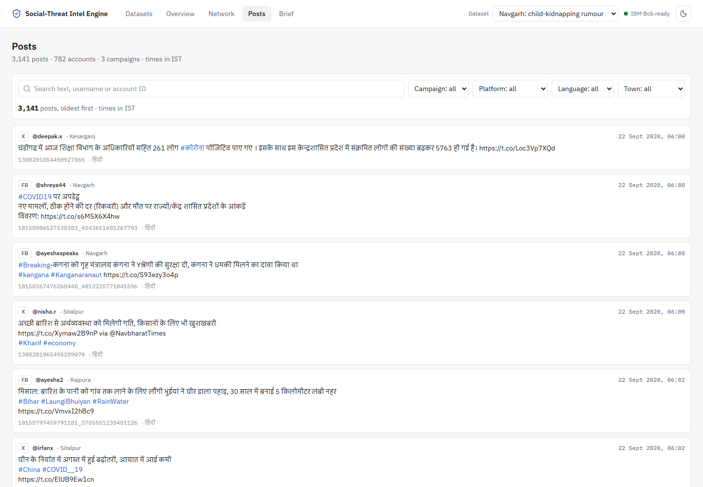

# Screenshots

The Command Center on the three bundled incident packs (light theme; the header button switches to dark). Design language: [`docs/design-system.md`](../../docs/design-system.md).

---

### 1. Datasets (`01-datasets.png`)
The three incident packs, each with a one-line description. Left: the upload box (CSV, Excel, JSON, X API data, WhatsApp and Telegram exports; any column names, with a "Which column is which?" step when they can't be matched) and **Search X**, which pulls the last 7 days of posts for a query straight from the X API.

---

### 2. Overview: the incident at a glance (`02-overview.png`)
Navgarh child-kidnapping rumour. A summary paragraph written from the data opens the page (3 campaigns, 1 urgent, 1 on alert, period, platforms, languages). **Emerging offline threats** follows: IBM Bob found a crowd called to Rajpura bus stand at 18:00, 2 h 20 m after the last post, and the network was flagged 7 h 12 m before it. The incident timeline marks the first post, the flag, the peak and the gathering; the campaign table shows each campaign's activity, platforms and languages; the detail panel starts with the call to gather and how it spread (WhatsApp → X → Facebook → Telegram; Rajpura → Navgarh → Kesarganj → Sitalpur).

---

### 3. Network (`03-network.png`)
Kalyanpur procession rumour: accounts joined when they repeatedly acted together within seconds. The selected network (the call to Kalyan Chowk with sticks at 8 PM) is highlighted and labelled; the accounts that started it have a thick ring, amplifiers are larger.

---

### 4. Spread map and IBM Bob assessment (`04-bob-assessment.png`)
Bhimnagar paper-leak scam: the "Where it spread" map numbers the towns in the order reached with a flag at the board office; the panel shows who started the pile-on (accounts 17–25 days old), why it was flagged and IBM Bob's assessment, including the gherao at 11:00 quoted from a Hindi post.

---

### 5. Threat brief (`05-threat-brief.png`)
The printable brief for the SHO: the planned gathering first (place, time, lead time and a timeline strip), IBM Bob's summary, then each campaign with how it spread, why it was flagged, the assessment, legal sections to verify, time- and place-specific actions and SHA-256 evidence hashes.

---

### 6. Posts (`06-posts.png`)
Every post of the dataset, searchable and filterable by campaign, platform, language and town. Accounts, hashtags (in any script), towns and campaigns are links: clicking one here or in the campaign panel filters the list to it.

