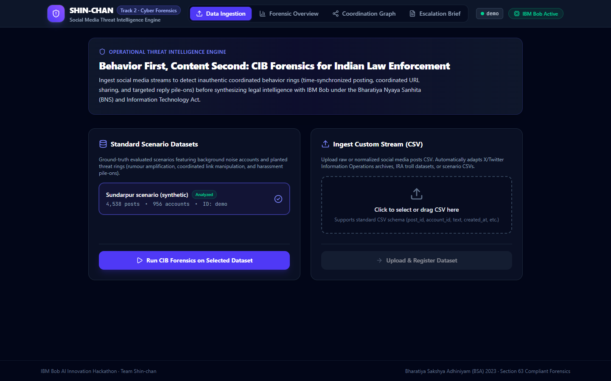
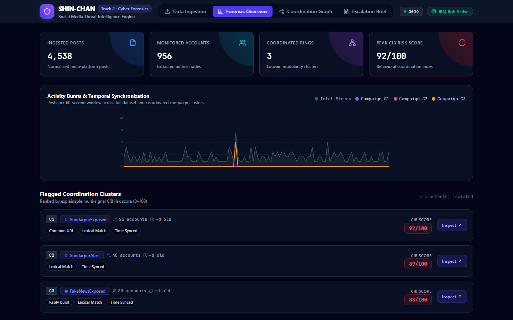
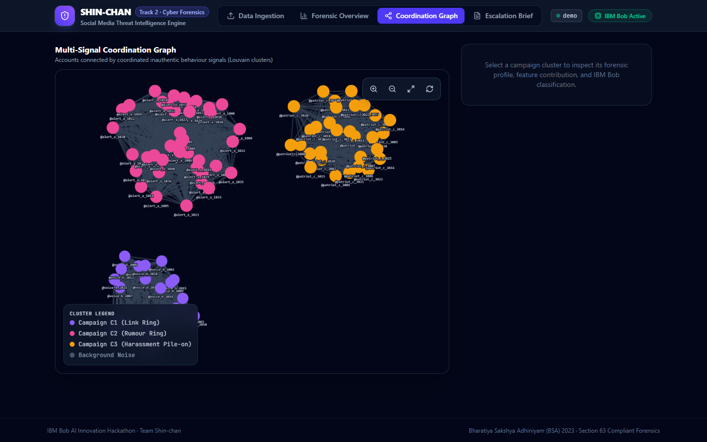

# Screenshots

Visual walkthrough of the **SHIN-CHAN Social Media Threat Intelligence Engine** running with full forensic data and IBM Bob AI reasoning.

---

### 1. Data Ingestion & Dataset Selection (`01-landing-page.png`)
*Choose between standard benchmark scenarios (Sundarpur synthetic) or upload custom CSV streams from X/Twitter or messaging platforms.*

---

### 2. Forensic Overview & Activity Timeline (`02-forensic-overview.png`)
*Executive metric tiles, 60-second burst activity timeline (Recharts/SVG), and ranked coordination clusters with explainable CIB scores.*

---

### 3. Multi-Signal Coordination Graph (`03-coordination-network.png`)
*Cytoscape network topology showing Louvain-detected communities (Rumour ring, Link ring, Harassment pile-on) color-coded with degree-sized nodes.*

---

### 4. IBM Bob Threat Classification & Legal Analysis (`04-ibm-bob-verdict.png`)
*Deep campaign analysis powered by IBM Bob (`bob run`): threat categorization, target isolation, physical mobilization risk alerts, and BNS 2023 / IT Act statutory suggestions.*

---

### 5. Section 63 BSA Threat Escalation Brief (`05-threat-brief.png`)
*Electronic evidence brief compliant with Section 63 Bharatiya Sakshya Adhiniyam (BSA) 2023, featuring SHA-256 evidence chain verification for Station House Officers.*

