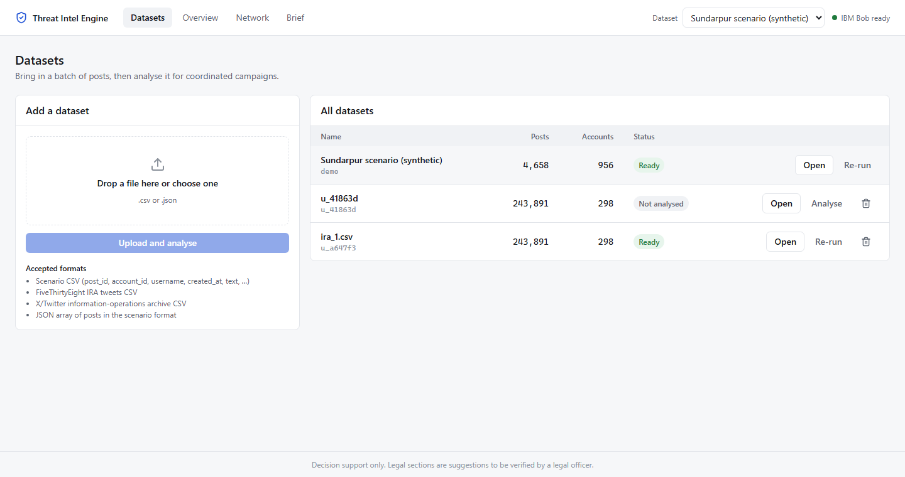

# Screenshots

The Command Center running on the bundled demo dataset (light theme). Design language: [`docs/design-system.md`](../../docs/design-system.md).

---

### 1. Datasets (`01-datasets.png`)
Upload a CSV or JSON batch and see every dataset with its status (Not analysed / Analysing step n of 10 / Ready / Failed).

---

### 2. Overview (`02-overview.png`)
Key numbers, the posts-per-minute timeline with each campaign as a coloured line, and the ranked campaign table. The selected campaign (C2, the dam-flood rumour ring) shows why it was flagged and IBM Bob's assessment: incitement, Urgent, with a call to gather offline.

---

### 3. Network (`03-network.png`)
Accounts joined when they repeatedly posted the same text, link or reply within seconds. The selected campaign is highlighted and labelled; the same detail panel sits beside it.

---

### 4. IBM Bob on the benign decoy (`04-bob-assessment.png`)
Cricket fans chanting together are coordinated, so they are detected (score 72, the lowest), but IBM Bob labels them benign and the rules escalate them only to Monitor. The posts Bob cited are marked.

---

### 5. Threat brief (`05-threat-brief.png`)
Time-stamped, print-ready brief for the SHO with SHA-256 evidence hashes. IBM Bob writes only the summary.

