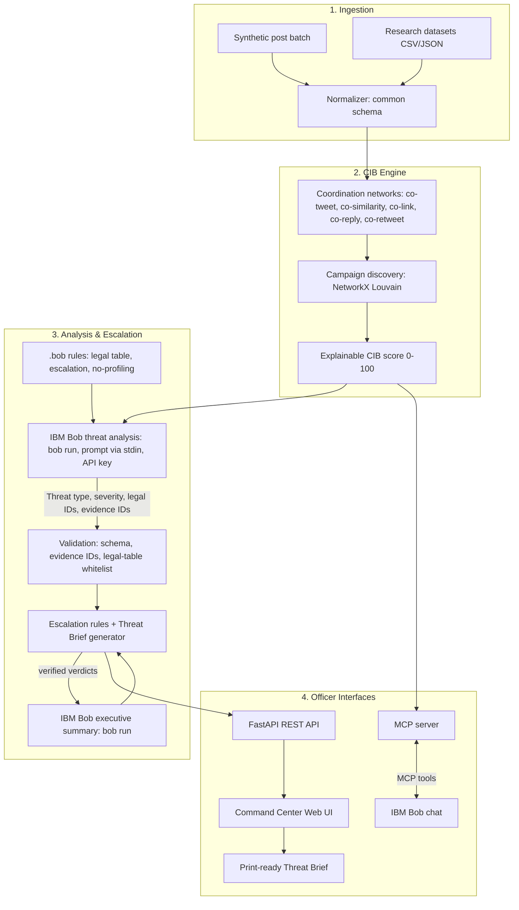
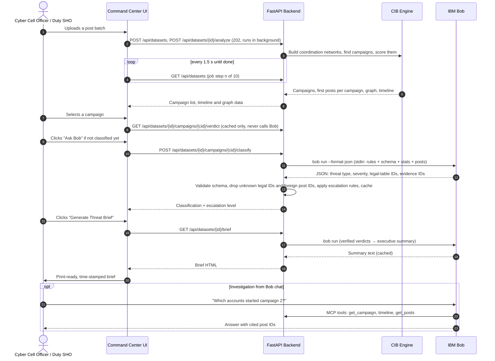

# System Architecture: Social Media Threat Intelligence Engine

## High-Level Architecture

The **Social Media Threat Intelligence Engine** is a pipeline with five parts: an ingestion layer, a coordination-detection and campaign-scoring engine, an IBM Bob threat-analysis layer, a rule-based escalation and brief generator, and two officer interfaces (a web Command Center and Bob chat via MCP).

---

## Component Details

| Component | Technology | Responsibility |
|---|---|---|
| **API Server** | FastAPI / Uvicorn (Python 3.10+) | Endpoints for dataset upload, analysis, campaigns, graph data, Bob classification, and brief export; serves the static frontend. |
| **Coordination Detection** | coordination-network-toolkit (QUT, MIT) + SQLite | Builds account-to-account coordination networks within configurable time windows. |
| **Campaign Discovery & Scoring** | NetworkX, Python | Community detection on the merged graph; explainable per-feature CIB score. |
| **Threat Analysis** | IBM Bob headless (`bob run --format json`), `BOB_API_KEY`, prompt via stdin | Classifies each campaign, extracts target and narrative, chooses legal-table IDs, cites evidence post IDs. Validated with Pydantic and cached as JSON (~0.025 Bobcoins, ~11 s per campaign in testing). |
| **Legal Reference & Escalation** | `.bob/rules-osint-analyst/01-legal-table.md` + Python rules | One legal table (with IDs) used by Bob chat, embedded in prompts, and parsed to validate Bob's answers; deterministic escalation matrix (MONITOR / ALERT / URGENT). |
| **Brief Summary** | IBM Bob headless (`bob run`) | Writes the brief's executive summary from verified verdicts only; cached per dataset and cleared when a verdict or the analysis changes. |
| **IBM Bob MCP Server** | Python MCP SDK (FastMCP), registered in `.bob/mcp.json` | Read-only tools `list_campaigns`, `get_campaign`, `get_posts`, `timeline`, `account_profile` so officers can investigate from Bob chat (IBMid sign-in). |
| **Command Center UI** | React 19 + Vite, Tailwind CSS, Cytoscape.js (network graph), SVG timeline, lucide-react icons | Datasets (upload, status, progress), Overview (key numbers, timeline, campaign table + detail), Network (graph + detail), Brief. Design language in [`design-system.md`](design-system.md). Built to `src/web/dist/` and served by FastAPI. |
| **Analysis jobs** | Python thread per dataset, in-memory job table | `POST /analyze` returns at once; the UI polls and shows the current step of 10 and elapsed time. |
| **Threat Brief** | Markdown/HTML + print CSS | Time-stamped brief with SHA-256 hashes, timeline, evidence table, legal suggestions, recommended actions. |

---

## End-to-End Data Flow

---

## Security Considerations

1. **Offline core:** Coordination detection, scoring, and legal/escalation rules run locally without cloud calls; only the Bob steps need a connection, and their results are cached. Without a key the app still runs and serves cached verdicts.
2. **Credential handling:** The only secret is the Bob API key (`BOB_API_KEY`), read from `src/.env`, which is excluded by `.gitignore`. We use Inference-type keys (inference only), one per developer, and check `git grep -E "bob_prod_[A-Za-z0-9_-]{30,}"` before every push. Bob chat uses the officer's own IBMid sign-in.
3. **Bounded AI output:** Bob's answers are schema-validated; cited post IDs must belong to the campaign and legal sections must come from our fixed table, so Bob cannot introduce evidence or sections we have not checked. `bob run` executes in an empty working folder, so it cannot read or change project files.
4. **Evidence integrity:** Every input batch and evidence post is hashed with SHA-256 and the hashes are printed in the brief, supporting a tamper-evident record for a Section 63 Bharatiya Sakshya Adhiniyam (BSA) 2023 electronic-evidence certificate.
5. **No profiling:** Classification is based on behaviour and content; rules instruct Bob never to infer or label people by religion, caste, or community.
6. **Mock data:** The demo uses fictional places and groups only.

---

## Scalability Notes

- **Coordination computation:** The toolkit is parallelised and processes millions of posts on one machine for the simpler network types; co-similarity is the most CPU-intensive.
- **Horizontal scaling:** The stateless FastAPI service can be scaled behind a load balancer; long analyses can move to a background job queue.
- **LLM cost control:** The CIB engine acts as a filter — only high-scoring campaigns (not individual posts) are sent to Bob, and results are cached.
