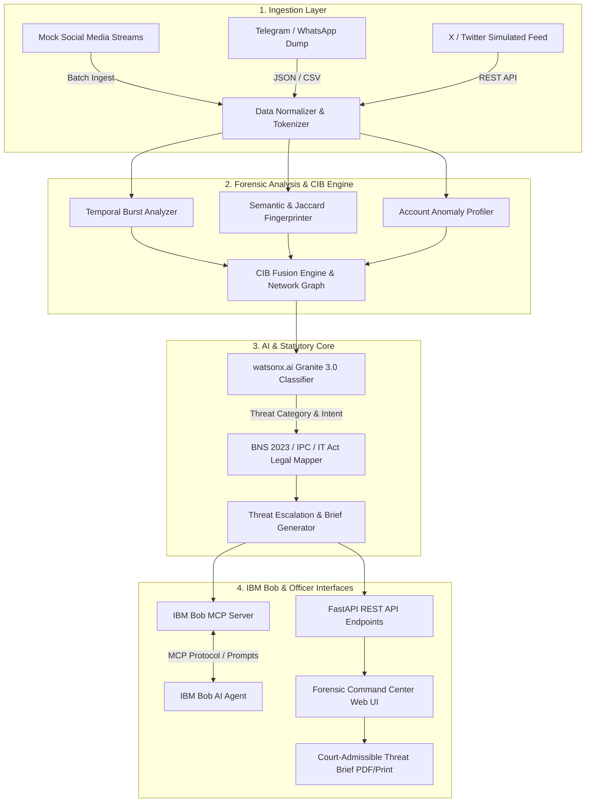
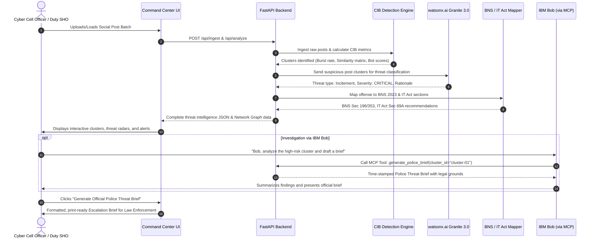

# System Architecture: Social Media Threat Intelligence Engine

## High-Level Architecture

The **Social Media Threat Intelligence Engine** is engineered as a decoupled, microservices-ready forensic pipeline. It consists of an ingestion ingestion layer, an algorithmic CIB correlation pipeline, an LLM-driven threat classifier powered by watsonx.ai Granite 3.0, a statutory legal rulebase, an IBM Bob Model Context Protocol (MCP) server, and an interactive Cyber Command Center interface.

---

## Component Details

| Component | Technology | Responsibility |
|---|---|---|
| **API Server & Routing** | FastAPI / Uvicorn (Python 3.10+) | Asynchronous HTTP endpoints for post ingestion, analysis orchestration, brief export, and static frontend serving. |
| **CIB Detection Core** | Python (NumPy, Collections, Regex) | Calculates temporal burst velocity ($\Delta t \le 120s$), pairwise Jaccard similarity, hash-frequency distributions, and bot-likelihood indicators. |
| **Threat Classifier** | IBM watsonx.ai (Granite 3.0 8B Instruct) / Local NLP Fallback | Evaluates contextual semantics, identifies inciting mobilization language, communal hate speech, and targeted harassment vectors. |
| **Statutory Legal Mapper** | Python Knowledge Base Rulebase | Correlates forensic signals with Bharatiya Nyaya Sanhita (BNS) 2023, Indian Penal Code (IPC), and Information Technology Act 2000 provisions. |
| **IBM Bob MCP Server** | Model Context Protocol (JSON-RPC) | Exposes standard MCP tools allowing IBM Bob to run cyber investigations, query suspect networks, and generate police briefs via natural language. |
| **Forensic Command UI** | HTML5, Vanilla CSS, JavaScript, Canvas Graph | High-contrast, responsive cyber cell dashboard with live post triage, cluster visualization, legal reference explorer, and brief preview. |
| **Police Brief Engine** | Jinja2 Template Engine / Markdown | Renders time-stamped, official-format Cyber Threat Intelligence Briefs with incident identifiers, evidentiary hashes, and immediate escalation steps. |

---

## End-to-End Data Flow

---

## Security Considerations

1. **Air-Gapped & Offline Operability:** The core CIB engine and legal mapping rulebase operate fully in-memory without mandatory external cloud connections, ensuring continuity during cyber blackouts or field deployments.
2. **Credential Sanitization:** All watsonx.ai API keys and cloud credentials are read exclusively from environment variables (`.env`), enforced by `.gitignore` rules.
3. **Evidentiary Integrity & Cryptographic Hashing:** Every ingested batch and generated threat brief includes SHA-256 integrity checksums, establishing a tamper-evident chain of custody compliant with Section 63 of the Bharatiya Sakshya Adhiniyam (BSA) 2023 (electronic evidence admissibility).
4. **Principle of Least Privilege:** Read-only analysis modes prevent accidental data mutation during sensitive criminal investigations.

---

## Scalability Notes

- **Stream Ingestion Scaling:** The stateless FastAPI architecture can be scaled horizontally across container clusters (e.g., Red Hat OpenShift / Kubernetes) behind an NGINX ingress.
- **Asynchronous Batch Processing:** For millions of tweets during a major law-and-order incident, ingestion tasks can be dispatched to Celery/Redis background queues or Apache Kafka topics.
- **LLM Rate-Limit Optimization:** To prevent watsonx.ai latency bottlenecks during viral surges, the CIB engine acts as an aggressive filter: only posts exhibiting high coordination scores ($CIB \ge 0.65$) are dispatched to the LLM for deep semantic classification, reducing inference costs by over 90%.
