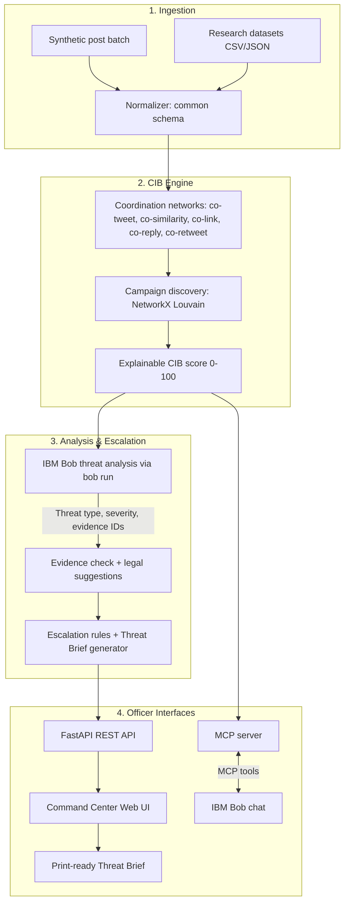
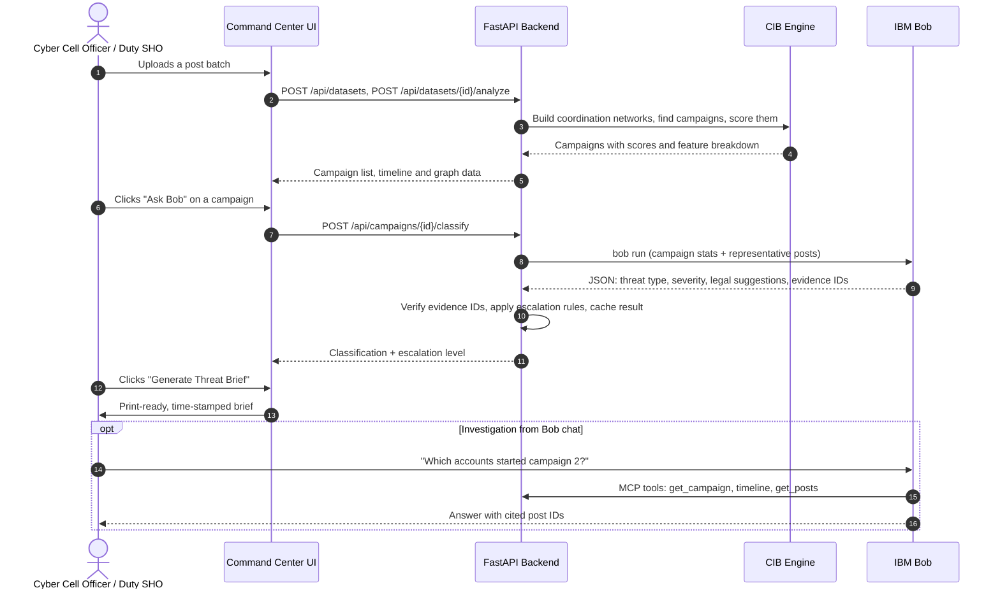

# System Architecture: Social Media Threat Intelligence Engine

## High-Level Architecture

The **Social Media Threat Intelligence Engine** is a pipeline with five parts: an ingestion layer, a coordination-detection and campaign-scoring engine, an IBM Bob threat-analysis layer, a rule-based escalation and brief generator, and two officer interfaces (a web Command Center and Bob chat via MCP).

---

## Component Details

| Component | Technology | Responsibility |
|---|---|---|
| **API Server** | FastAPI / Uvicorn (Python 3.10+) | Endpoints for dataset upload, analysis, campaigns, graph data, Bob classification, and brief export; serves the static frontend. |
| **Coordination Detection** | coordination-network-toolkit (QUT, MIT) + SQLite | Builds account-to-account coordination networks within configurable time windows. |
| **Campaign Discovery & Scoring** | NetworkX, Python | Community detection on the merged graph; explainable per-feature CIB score. |
| **Threat Analysis** | IBM Bob (`bob run --mode osint-analyst --format json`) | Classifies each campaign, extracts target and narrative, suggests legal sections, cites evidence post IDs. Results cached in SQLite. |
| **Legal Reference & Escalation** | Python rule tables | BNS 2023 / IPC / IT Act reference table and deterministic escalation matrix (MONITOR / ALERT / URGENT). |
| **IBM Bob MCP Server** | Python MCP SDK | Exposes `list_campaigns`, `get_campaign`, `get_posts`, `timeline` so officers can investigate from Bob chat. |
| **Command Center UI** | HTML, CSS, JavaScript, Cytoscape.js, Chart.js | Upload, overview dashboard, posts-per-minute timeline, network graph coloured by campaign, "why flagged" panel, brief preview. |
| **Threat Brief** | Markdown/HTML + print CSS | Time-stamped brief with SHA-256 hashes, timeline, evidence table, legal suggestions, recommended actions. |

---

## End-to-End Data Flow

---

## Security Considerations

1. **Offline core:** Coordination detection, scoring, and legal/escalation rules run locally without cloud calls; only the Bob analysis step needs a connection, and its results are cached.
2. **Credential handling:** Keys (e.g., `BOB_API_KEY`) are read only from environment variables; `.env` is excluded by `.gitignore`.
3. **Evidence integrity:** Every input batch and evidence post is hashed with SHA-256 and the hashes are printed in the brief, supporting a tamper-evident record for a Section 63 Bharatiya Sakshya Adhiniyam (BSA) 2023 electronic-evidence certificate.
4. **No profiling:** Classification is based on behaviour and content; rules instruct Bob never to infer or label people by religion, caste, or community.
5. **Mock data:** The demo uses fictional places and groups only.

---

## Scalability Notes

- **Coordination computation:** The toolkit is parallelised and processes millions of posts on one machine for the simpler network types; co-similarity is the most CPU-intensive.
- **Horizontal scaling:** The stateless FastAPI service can be scaled behind a load balancer; long analyses can move to a background job queue.
- **LLM cost control:** The CIB engine acts as a filter — only high-scoring campaigns (not individual posts) are sent to Bob, and results are cached.
